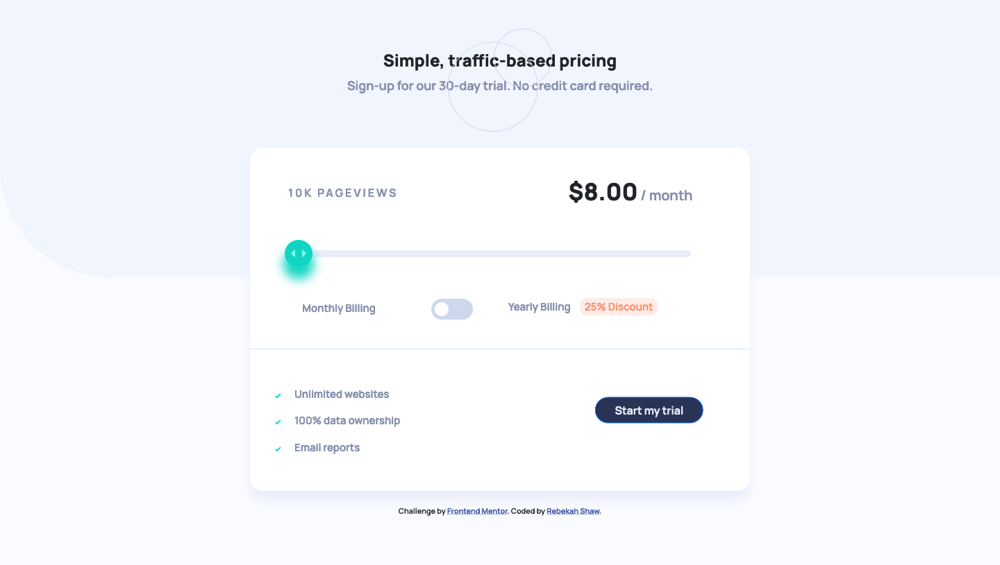
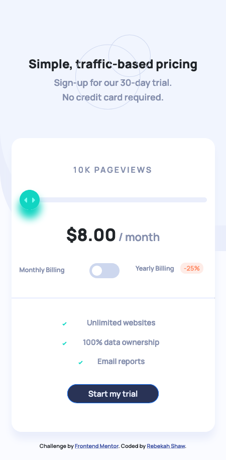

# Frontend Mentor - Interactive pricing component solution

This is a solution to the [Interactive pricing component challenge on Frontend Mentor](https://www.frontendmentor.io/challenges/interactive-pricing-component-t0m8PIyY8). Frontend Mentor challenges help you improve your coding skills by building realistic projects. 

## Table of contents

- [Overview](#overview)
  - [The challenge](#the-challenge)
  - [Screenshot](#screenshot)
  - [Links](#links)
- [My process](#my-process)
  - [Built with](#built-with)
  - [What I learned](#what-i-learned)
  - [Continued development](#continued-development)
  - [Useful resources](#useful-resources)
- [Author](#author)

## Overview

### The challenge

Users should be able to:

- View the optimal layout for the app depending on their device's screen size
- See hover states for all interactive elements on the page
- Use the slider and toggle to see prices for different page view numbers

### Screenshot

#### Desktop



#### Mobile



### Links

- Solution URL: [ Solution](https://github.com/rebekahshaw92//interactive-pricing-component)
- Live Site URL: [Live Site](https://rebekahshaw92.github.io/interactive-pricing-component/)

### What I Leanred

When undertaking this project I was able to continue working with both Bootstrap 5 and JavaScript. I used a switch statement to be aboe to get each value when the slider is clicked.

```js

function setPrice() {
    let value = parseInt(slider.value);
    switch (value) {
       case 1:
           pageViews.innerText = "10K pageviews";
           price.innerHTML = "$" + ipcPrice.toFixed(2) + "<span> / month </span>";
           priceMobile.innerHTML = "$" + ipcPrice.toFixed(2) + "<span> / month </span>";
           break;
       case 2:
           ipcPrice = 12;
           pageViews.innerText = "50k pageviews";
           price.innerHTML = "$" + ipcPrice.toFixed(2) + "<span> / month </span>";
           priceMobile.innerHTML = "$" + ipcPrice.toFixed(2) + "<span> / month </span>";
           break;
        case 3:
            ipcPrice = 16;
            pageViews.innerHTML = "100K pageviews";
            price.innerHTML = "$" + ipcPrice.toFixed(2) + "<span> / month </span>";
            priceMobile.innerHTML = "$" + ipcPrice.toFixed(2) + "<span> / month </span>";
            break;
        case 4:
            ipcPrice = 24;
            pageViews.innerText = "500k pageviews";
            price.innerHTML = "$" + ipcPrice.toFixed(2) + "<span> / month </span>";
            priceMobile.innerHTML = "$" + ipcPrice.toFixed(2) + "<span> / month </span>";
            break;
        case 5:
            ipcPrice = 36;
            pageViews.innerText = "1M pageviews";
            price.innerHTML = "$" + ipcPrice.toFixed(2) + "<span> / month </span>";
            priceMobile.innerHTML = "$" + ipcPrice.toFixed(2) + "<span> / month </span>";
            break;
        default:
            break;

    }
}
```

The switch case allowed me to add informartion to the DOM depending where the user had scrolled to on the slider.

While working on this project I also learned how to create a toggle buton using HTML and CSS.

I started by addeding a checkbox.

``` HTML

  <input type="checkbox" name="switch" id="switch">
  <label for="switch" class="switchLabel"></label>

```

I was then able to hide the checkbox and add style to the label by adding style after it. 

``` css

.switchLabel:after {
  content: "";
  position: absolute;
  top: 5px;
  left: 5px;
  width: 20px;
  height: 20px;
  background: #fff;
  border-radius: 90px;
  transition: 0.3s;
}

```

I was then able to add style to the input when it was checked to allow the toggle to slide

``` css

input:checked + .switchLabel {
	background: $softCyan;
}

input:checked + .switchLabel:after {
	left: calc(100% - 5px);
	transform: translateX(-100%);
}

.switchLabel:active:after {
	width: 20px;
}
```

### Continued Development

I was to content to work with both Bootstrap 5 and JavaScript and learning what I can do with them. 

### Useful Development

- [Bootstrap]https://getbootstrap.com) - This site helped me learn all I needed to know about Bootstrap.

- [Toggle](https://codepen.io/mburnette/pen/LxNxNg) - This allowed me to learn how to create a toggler.

- [W3Schools](https://www.w3schools.com/howto/howto_js_rangeslider.asp) - This allowed me to learn how to change the range slider image.

## Author

- Website - [Rebekah Shaw](https://www.rebekahshaw.com)
- Frontend Mentor - [@rebekahshaw92](https://www.frontendmentor.io/profile/rebekahshaw92)
- Twitter - [@x_beckyboo_x](https://www.twitter.com/x_beckyboo_x)

